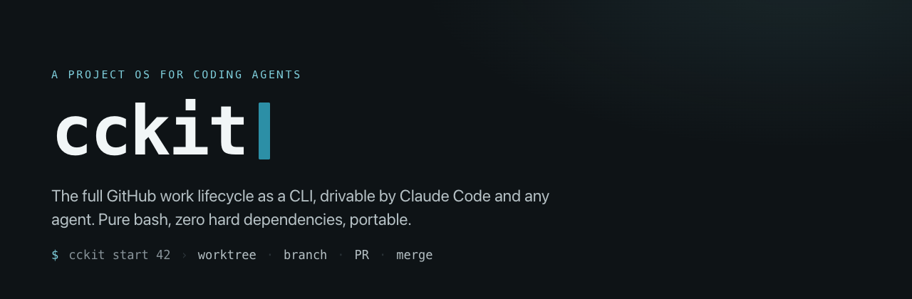

<p align="center">
  
</p>

# cckit

> A project operating system for coding agents — the full GitHub work lifecycle as a CLI, drivable by Claude Code and any other agent.

[](#license)
[](https://docs.claude.com/claude-code)
[](https://cckit.vercel.app)
[](#platforms--requirements)

**[📖 Documentation](https://cckit.vercel.app)** · [Quick start](#quick-start) · [Contributing](CONTRIBUTING.md) · [Code of Conduct](CODE_OF_CONDUCT.md)

cckit turns a Git repository into a structured, agent-operable workspace. It ships the entire
GitHub lifecycle — issues, branches, isolated worktrees, PRs, the merge flow, garbage collection,
and a multi-agent orchestrator — as a single bash CLI plus a Claude Code plugin (skills, rules,
agents). It is **agent-agnostic by design**: Claude Code is first-class, but any agent that can run
a shell can drive every operation.

## Why

- **One lifecycle, one source of truth.** Start an issue, get an isolated worktree and branch, open
  a PR, merge, and clean up — each step is one command, correct by construction.
- **Agent-operable.** Every verb has a machine-readable mode (`cckit <verb> --llm`) and an
  [`AGENTS.md`](AGENTS.md) contract, so agents drive the kit without scraping human output.
- **Zero hard dependencies.** Pure bash with graceful fallbacks; it auto-detects optional tools
  (`gh`, `jq`, `fzf`, `gum`) and degrades instead of failing.
- **Portable.** No company, framework, or repo is baked in — everything is driven from
  `cckit.config.json`.

## Install

**One-liner (macOS · Linux · WSL):**

```bash
curl -fsSL https://raw.githubusercontent.com/jeiemgi/cckit/main/scripts/web-install.sh | bash
```

**Homebrew:**

```bash
brew tap jeiemgi/cckit && brew install cckit
```

**npm** (the bare `cckit` name is taken, so cckit is scoped):

```bash
npm install -g @jeiemgi/cckit
```

**From source:**

```bash
git clone https://github.com/jeiemgi/cckit.git
cd cckit && ./scripts/install.sh    # symlinks bin/cckit onto your PATH
```

### Platforms & requirements

| Platform | Supported |
| --- | --- |
| macOS | ✅ native |
| Linux | ✅ native |
| Windows | ✅ via WSL or Git Bash (not native cmd/PowerShell) |

Requirements: `bash` 4+, `git`, and `gh` (GitHub CLI) authenticated. `jq` recommended.

## Quick start

```bash
cckit init                 # scaffold cckit.config.json + .claude/ for this repo
cckit plan-next            # propose what to build next, grounded in current capabilities
cckit next                 # the next unblocked issue + how to start it
cckit start 42             # isolated worktree + branch for issue #42
cckit pr 42 "what changed" # commit, push, open the PR
cckit sync                 # board state, what's unblocked
cckit gc                   # prune merged branches + worktrees
```

Run `cckit help` for the full verb list, or `cckit <verb> --help` for any one.

For a goal too big for one PR, `cckit effort new "<name>" "sub :: desc" …` creates the parent issue
(the four-section plan body), applies the `ctx/kind/priority/role/flow` labels, and lints every
sub-issue title — the same effort `/kit-effort-new` produces, since both call one shared core.

## Wave

`cckit wave` reads your open efforts and proposes the incoming waves of work — parallel agent tasks
that gate and merge themselves:

```bash
cckit plan                 # the wave plan: deps-ordered, file-disjoint, session-fit
cckit wave                 # a Task-subagent fan-out brief Claude Code enacts (proposes the next wave)
cckit watch --merge        # the captain: gate open PRs, squash-merge the CLEAN ones, advance
cckit watch --loop         # self-pace gate/merge passes until steady state
```

## Driven by agents

cckit is meant to be operated by an agent loop, not only a human. See [`AGENTS.md`](AGENTS.md) for
the contract. Every verb accepts `--llm` for structured output — uniform payloads come back as
**TOON** (token-efficient), so the plan, board, and fan-out cost the model far fewer tokens:

```bash
cckit sync --llm           # board state for an agent to reason over
cckit plan --llm           # the wave plan as TOON rows
cckit wave --llm           # the fan-out (one subagent prompt per issue) as TOON
```

Human output renders as markdown — rich via `glow` in a terminal, native in the Claude Code
transcript, pipe-safe everywhere (`cckit render` exposes the seam for any script).

## Documentation

Full docs, the [cookbook](https://cckit.vercel.app/cookbook/) of lifecycle recipes, and the [CLI reference](https://cckit.vercel.app/cli-reference/) live at **[cckit.vercel.app](https://cckit.vercel.app)**.

## Project layout

```
cckit/
  bin/cckit              # the CLI dispatcher
  scripts/lib/*.sh       # the git-mechanics bundle (effort, worktree, gh, gc, …)
  .claude-plugin/        # the Claude Code plugin manifest
  skills/ commands/      # Claude Code skills + slash commands
  profiles/ templates/   # init profiles + scaffold templates
  docs-site/             # documentation source — Astro/Starlight (deployed to cckit.vercel.app)
  cckit.config.json      # project configuration (no hardcoded org/repo)
```

## Built with cckit

Using cckit in your project? Add a badge (optional, but appreciated):

[](https://github.com/jeiemgi/cckit)

```markdown
[](https://github.com/jeiemgi/cckit)
```

More variants (HTML, flat-square): [docs/badge.md](docs/badge.md).

## Contributing

Issues and PRs welcome — see [`CONTRIBUTING.md`](CONTRIBUTING.md). cckit develops itself with its
own lifecycle (`cckit start` / `cckit pr`).

## Support

If cckit saves you time, you can support its development:

[](https://buymeacoffee.com/jeiemgi)

## License

Licensed under either of

- MIT license ([LICENSE-MIT](LICENSE-MIT))
- Apache License, Version 2.0 ([LICENSE-APACHE](LICENSE-APACHE))

at your option. Unless you explicitly state otherwise, any contribution intentionally submitted for
inclusion in cckit by you, as defined in the Apache-2.0 license, shall be dual licensed as above,
without any additional terms or conditions.

## Disclaimer & trademarks

cckit is an **independent, community-built project for educational purposes**. It is **not an
official Anthropic product** and is **not affiliated with, endorsed, sponsored, or supported by
Anthropic PBC** in any way.

"Anthropic", "Claude", and "Claude Code", along with related names, logos, and marks, are
trademarks of **Anthropic PBC**. All rights to Anthropic's products, services, names, and
intellectual property belong to Anthropic. cckit uses these names only **nominatively** — to
describe interoperability with Claude Code — and claims no ownership of or rights to them.

cckit is provided **"as is", without warranty of any kind**, for learning and experimentation.
Nothing here is legal advice. You are responsible for your own use of cckit and for complying with
the terms of any third-party service it integrates with, including
[Anthropic's Usage Policies and Terms](https://www.anthropic.com/legal). The cckit source code
itself is licensed as stated above; this disclaimer does not extend cckit's license to any
third-party trademark or product.
