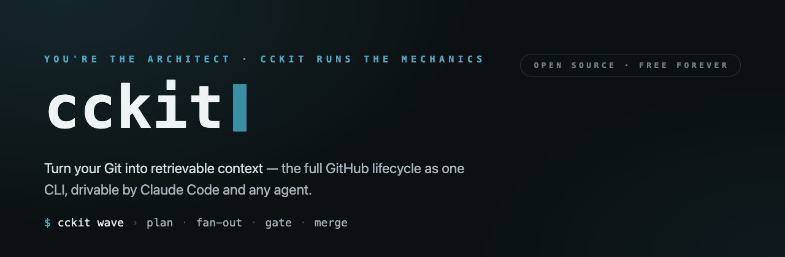

<p align="center">
  
</p>

# cckit

> **You're the architect. cckit runs the mechanics.** The full GitHub work lifecycle — issues,
> worktrees, PRs, merges, multi-agent waves — as one CLI, drivable by Claude Code and any agent.

[](#license)
[](https://docs.claude.com/claude-code)
[](https://cckit.dev)
[](#platforms--requirements)

**[📖 Documentation](https://cckit.dev)** · [The idea](https://cckit.dev/philosophy/) · [Tutorials](https://cckit.dev/tutorials/) · [Quick start](#quick-start) · [Contributing](CONTRIBUTING.md) · [Code of Conduct](CODE_OF_CONDUCT.md)

The whole idea in one line:

> **Turn your Git into retrievable, efficient context** — using issues, GitHub Projects, and other
> people's tools, wired together with a few advanced mechanics.

You bring the ideas and the shape of the thing. The mechanics that make it stand up — branches,
isolated worktrees, PRs, the merge flow, and the trail of issues that says *why* — are what cckit
takes care of. It ships all of that as a single bash CLI plus a Claude Code plugin (skills, rules,
agents), and it is **agent-agnostic by design**: Claude Code is first-class, but any agent that can
run a shell can drive every operation.

## Why

- **One lifecycle, one source of truth.** Start an issue, get an isolated worktree and branch, open
  a PR, merge, and clean up — each step is one command, correct by construction. The board is both
  the plan and the proof.
- **Sessions that pick up where you left off.** `cckit handoff "<note>"` saves a resume-here note;
  bare `cckit` prints it at the start of the next session — context survives the context window.
- **Agent-operable.** Every verb has a machine-readable mode (`cckit <verb> --llm`) and an
  [`AGENTS.md`](AGENTS.md) contract, so agents drive the kit without scraping human output.
- **Scales from one issue to a wave.** The same verbs that take one issue to a merged PR also plan
  and run a whole wave of parallel agents — with a captain that gates and merges behind policy
  floors.
- **Zero hard dependencies.** Pure bash with graceful fallbacks; it auto-detects optional tools
  (`gh`, `jq`, `fzf`, `gum`) and degrades instead of failing.
- **Portable.** No company, framework, or repo is baked in — everything is driven from
  `cckit.config.json`.

## Install

**One-liner (macOS · Linux · WSL):**

```bash
curl -fsSL https://raw.githubusercontent.com/jeiemgi/cckit/main/scripts/web-install.sh | bash
```

**Homebrew:**

```bash
brew tap jeiemgi/cckit && brew install cckit
```

**npm** (the bare `cckit` name is taken, so cckit is scoped):

```bash
npm install -g @jeiemgi/cckit
```

**From source:**

```bash
git clone https://github.com/jeiemgi/cckit.git
cd cckit && ./scripts/install.sh    # symlinks bin/cckit onto your PATH
```

### Platforms & requirements

| Platform | Supported |
| --- | --- |
| macOS | ✅ native |
| Linux | ✅ native |
| Windows | ✅ via WSL or Git Bash (not native cmd/PowerShell) |

Requirements: `bash` 4+, `git`, and `gh` (GitHub CLI) authenticated. `jq` recommended.

## Quick start

```bash
cckit doctor                  # onboarding preflight: deps, gh auth
cckit init --profile software # scaffold cckit.config.json + .claude/ for this repo
                              #   profiles: software · content · research · automation · minimal
cckit plan-next               # propose what to build next, grounded in current capabilities
cckit next                    # the next unblocked issue + how to start it
cckit start 42                # isolated worktree + branch for issue #42
cckit pr 42 "what changed"    # commit, push, open the PR
cckit sync                    # board state, what's unblocked
cckit handoff "resume note"   # save a handoff — bare `cckit` prints it next session
cckit gc                      # prune merged branches + worktrees
```

Adopting cckit in a repo that already has history? `cckit scan` detects the stack, `cckit adopt`
records kit-shaped files the repo already has, and `cckit status` is the thin dashboard — board,
worktrees, and the resume handoff in one screen. Run `cckit help` for the full verb list, or
`cckit <verb> --help` for any one.

## Efforts and slug handles

A big piece of work is an **effort** — a parent issue with sub-issues. `cckit effort new "<name>" "sub :: desc" …`
creates the parent issue (the four-section plan body), applies the `ctx/kind/priority/role/flow` labels, and lints
every sub-issue title — the same effort `/kit-effort-new` produces, since both call one shared core. The `--flow`
vocabulary (the `[Flow]` title tags) reads from `effort.flows` in the project config, so `cckit effort new --flow X`
works out of the box in any configured repo (an explicit `EFFORT_FLOWS` env var still wins per invocation).
`cckit effort close` is likewise the **single close implementation** (the `/kit-effort-close` skill is a thin caller
of the same function): pre-squash work-record snapshot + metrics, squash-merge, close parent + subs, board
Status=Done, worktree/branch GC, an optional knowledge-ingest hook, and an advisory kit-sync drift check.

The GitHub issue **number** stays the canonical key, but every effort also has a memorable **slug** handle (the one
already in its `effort/<N>-<slug>` branch). Effort commands take the slug *or* the number interchangeably:

```bash
cckit effort new "Slug handles for efforts" --slug slug-handles   # optional explicit handle
cckit effort start slug-handles                                   # same as: cckit effort start 93
cckit effort pr slug-handles
cckit effort close slug-handles
```

A pure-digits argument is always a number; anything else is resolved to the canonical number by
matching `effort/*` branches, the `slug:<slug>` label, then open effort titles. An unknown or
ambiguous slug fails with a clear error rather than guessing. Efforts render as `slug #N`.

## Waves — parallel agentic development

`cckit wave` reads your open efforts and proposes the incoming waves of work — parallel agent tasks
that gate and merge themselves. This is the part that turns one keyboard into a small team:

```bash
cckit plan                 # the wave plan: deps-ordered, file-disjoint, session-fit
cckit wave                 # a Task-subagent fan-out brief Claude Code enacts (proposes the next wave)
cckit orchestrate 12 14 17 # run N flows in parallel worktrees (--dry-run / --cap / --agent)
cckit watch --merge        # the captain: gate open PRs, squash-merge the CLEAN ones, advance
                           #   (policy floors hold PRs touching CI, lockfiles, or secrets for review)
cckit watch --loop         # self-pace gate/merge passes until steady state
cckit autopilot            # unattended multi-flow: drive (or auto-pick) issues under a cap
```

## Driven by agents

cckit is meant to be operated by an agent loop, not only a human. See [`AGENTS.md`](AGENTS.md) for
the contract. Every verb accepts `--llm` for structured output — uniform payloads come back as
**TOON** (token-efficient), so the plan, board, and fan-out cost the model far fewer tokens:

```bash
cckit sync --llm           # board state for an agent to reason over
cckit plan --llm           # the wave plan as TOON rows
cckit wave --llm           # the fan-out (one subagent prompt per issue) as TOON
```

Human output renders as markdown — rich via `glow` in a terminal, native in the Claude Code
transcript, pipe-safe everywhere (`cckit render` exposes the seam for any script).

## cckit builds cckit

None of this is theoretical. cckit is developed *with* cckit — every feature, fix, and tutorial went
through its own lifecycle: an issue, an isolated worktree, a pull request, a merge. The receipts are
public: [every issue closed in the repo →](https://github.com/jeiemgi/cckit/issues?q=is%3Aissue%20state%3Aclosed)
— including [the effort that produced this README](https://github.com/jeiemgi/cckit/issues/160).
The board is both the plan and the proof.

## Documentation

Full docs live at **[cckit.dev](https://cckit.dev)** — start with
[the idea](https://cckit.dev/philosophy/) if you want the why. The
[tutorials](https://cckit.dev/tutorials/) are step-by-step "How to X with Claude Code"
guides, each labelled **Beginner / Intermediate / Advanced** and carrying a **"Copy as Markdown"
prompt** you can paste straight into Claude Code — start exactly where you are. The
[cookbook](https://cckit.dev/cookbook/) holds lifecycle recipes, and the
[CLI reference](https://cckit.dev/cli-reference/) covers every verb.

## Project layout

```
cckit/
  bin/cckit              # the CLI dispatcher
  scripts/lib/*.sh       # the git-mechanics bundle (effort, worktree, gh, gc, …)
  .claude-plugin/        # the Claude Code plugin manifest
  skills/ commands/      # Claude Code skills + slash commands
  profiles/ templates/   # init profiles + scaffold templates
  routines/ modules/     # scheduled routines + optional modules
  docs-site/             # documentation source — Astro/Starlight (deployed to cckit.dev)
  cckit.config.json      # project configuration (no hardcoded org/repo)
```

## Built with cckit

Using cckit in your project? Add a badge (optional, but appreciated):

[](https://github.com/jeiemgi/cckit)

```markdown
[](https://github.com/jeiemgi/cckit)
```

More variants (HTML, flat-square): [docs/badge.md](docs/badge.md).

## Contributing

Issues and PRs welcome — see [`CONTRIBUTING.md`](CONTRIBUTING.md). cckit develops itself with its
own lifecycle (`cckit start` / `cckit pr`), and `cckit contribute "<summary>"` opens a contribution
PR gated on the repo checks. Be curious, and be kind — that's how the open-source community works.

## Support

If cckit saves you time, you can support its development:

[](https://buymeacoffee.com/jeiemgi)

## License

Licensed under either of

- MIT license ([LICENSE-MIT](LICENSE-MIT))
- Apache License, Version 2.0 ([LICENSE-APACHE](LICENSE-APACHE))

at your option. Unless you explicitly state otherwise, any contribution intentionally submitted for
inclusion in cckit by you, as defined in the Apache-2.0 license, shall be dual licensed as above,
without any additional terms or conditions.

## Disclaimer & trademarks

cckit is an **independent, community-built project for educational purposes**. It is **not an
official Anthropic product** and is **not affiliated with, endorsed, sponsored, or supported by
Anthropic PBC** in any way.

"Anthropic", "Claude", and "Claude Code", along with related names, logos, and marks, are
trademarks of **Anthropic PBC**. All rights to Anthropic's products, services, names, and
intellectual property belong to Anthropic. cckit uses these names only **nominatively** — to
describe interoperability with Claude Code — and claims no ownership of or rights to them.

cckit is provided **"as is", without warranty of any kind**, for learning and experimentation.
Nothing here is legal advice. You are responsible for your own use of cckit and for complying with
the terms of any third-party service it integrates with, including
[Anthropic's Usage Policies and Terms](https://www.anthropic.com/legal). The cckit source code
itself is licensed as stated above; this disclaimer does not extend cckit's license to any
third-party trademark or product.
