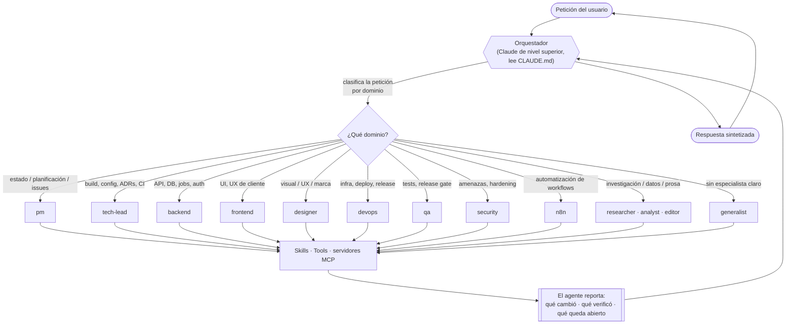
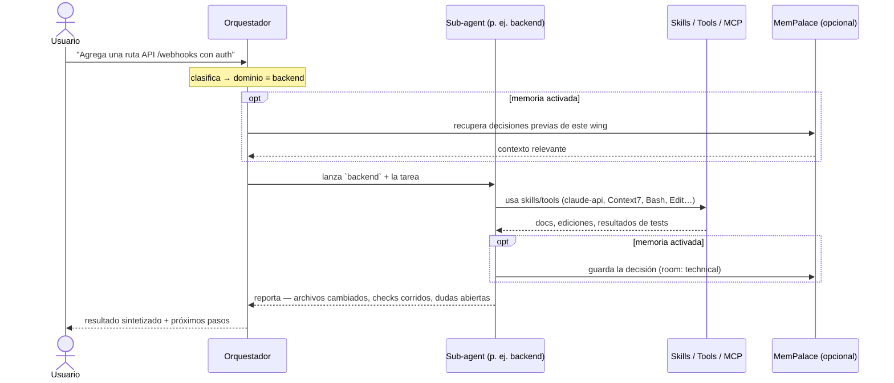
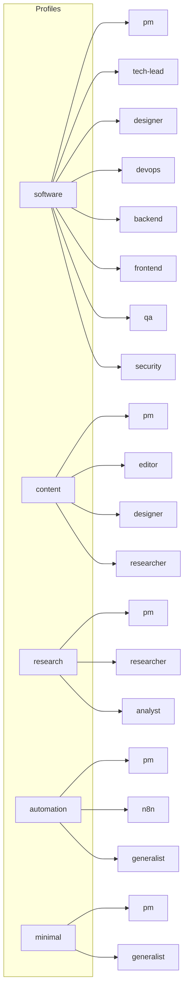

# Agentes y el modelo de orquestación

[English](agents.md) · [Español](agents.es.md)

[← Uso](usage.es.md) · **Agentes y orquestación** · [Referencia →](reference.es.md) · [README](../README.es.md)

claude-kit le da al proyecto una pequeña **organización** en vez de un único asistente que hace todo.
Un **orquestador** de nivel superior recibe cada petición y la rutea al **sub-agent** que es dueño de
ese dominio. Esta página explica por qué eso importa, quiénes son los agentes y cómo fluye exactamente
una petición a través de ellos.

## Por qué sub-agents (y no un asistente gigante)

Un solo asistente haciendo malabares con arquitectura, UI, seguridad y texto en un mismo contexto
tiende a difuminar responsabilidades y perder foco. Repartir el trabajo en agentes por rol te da:

- **Foco** — cada agente carga solo las instrucciones, skills y tools de su dominio, así su contexto
  se mantiene nítido.
- **Las tools correctas por rol** — el agente `backend` recibe `claude-api` + Context7; `qa` recibe
  Playwright + Chrome DevTools; `n8n` recibe las skills `n8n-*` + las tools `mcp__n8n__*`. Ningún
  agente queda sobrecargado.
- **Propiedad clara** — cada cambio tiene un dueño obvio, y los agentes _derivan_ cuando cruzan
  límites (`backend` manda la UI a `frontend`, la infra a `devops`) en vez de adivinar.
- **Decisiones más seguras** — las decisiones de dominio las toma el rol que tiene la profundidad, no
  un generalista.

## El orquestador

El orquestador es el Claude de nivel superior del proyecto. Su trabajo es **rutear y sintetizar, no
hacer trabajo de dominio**. Según el `CLAUDE.md` del proyecto:

> Lanza el agente correspondiente para cualquier tarea de dominio — no respondas decisiones de dominio
> desde el nivel del orquestador.

El orquestador clasifica, delega y vuelve a unir la respuesta. Los agentes hacen el trabajo de dominio
real, cada uno con sus propias skills y tools.

## Cómo se maneja una petición

Si una tarea cruza dominios, el orquestador delega en varios agentes por turnos (p. ej. `backend` para
el endpoint, luego `frontend` para la UI, luego `qa` para el test) y sintetiza el resultado combinado.

## Los agentes

Cada agente es un archivo en `.claude/agents/<name>/AGENT.md` con un contrato de frontmatter (`name`,
`description`, `when_to_use`, `tools`, `skills`). Qué agentes existen en un proyecto depende de su
[profile](#profiles--qué-agentes-obtienes).

| Agente           | Es dueño de                                                                                  | Se invoca cuando                                                          | Skills / tools clave                                         |
| ---------------- | -------------------------------------------------------------------------------------------- | ------------------------------------------------------------------------- | ------------------------------------------------------------ |
| `pm`             | Estado del trabajo vía GitHub; redacta issues, repara enlaces plan↔issue, expone bloqueos    | "¿Cómo está el estado?", planificación de sprint, issues de alcance nuevo | `task-sync` · `task-new` · `task-close` · `morning-briefing` |
| `tech-lead`      | Build system, toolchain, ADRs, CI/CD, reglas de lint, scaffolding                            | Cambios de config/toolchain, ADRs, cambios de CI, módulos nuevos          | Context7 · GitHub navigator                                  |
| `designer`       | Design system, marca, pantallas, motion, todas las decisiones visuales/UX                    | Cualquier decisión visual, componentes, UX writing, a11y de UI            | skills de diseño + GSAP                                      |
| `devops`         | Infra, pipelines CI/CD, deploy, release/distribución, migraciones                            | Cloud/infra, GitHub Actions, secrets, monitoreo, DNS                      | Context7 · GitHub navigator                                  |
| `backend`        | API, modelo de datos/ORM, schema, jobs, realtime, auth, lógica de servidor                   | Rutas API, migraciones, colas, WebSocket/SSE, integraciones               | `claude-api` · Context7                                      |
| `frontend`       | Todo el UI de cliente, app shell, UX de cliente, integración de API, superficie tipada       | Componentes, estado, streaming, navegación, UI de auth, animación         | `claude-api` · GSAP · Chrome DevTools · Context7             |
| `qa`             | Tests E2E, verificación de aceptación, regresión, el release gate                            | Escribir/​depurar tests, auditorías a11y/perf, release gate               | Playwright · Chrome DevTools                                 |
| `security`       | Threat modeling, auditorías de vulnerabilidades, defensa anti-inyección, auth/CSP/CORS, deps | Riesgos de inyección, hardening de auth, CVEs, higiene de secrets         | `claude-api`                                                 |
| `researcher`     | Investigación primaria/secundaria, fact-checking, briefs con citas                           | Scans de mercado/competencia, verificar una afirmación, juntar fuentes    | `deep-research` · Context7                                   |
| `editor`         | Contenido escrito — estructura, claridad, voz, line edits, listo para publicar               | Redactar/revisar prosa, ediciones estructurales + de línea, tono          | —                                                            |
| `analyst`        | Trabajo cuantitativo — manejo de datos, modelado, recomendaciones defendibles                | Analizar un dataset, métricas, validar un número                          | Context7                                                     |
| `generalist`     | Lo que ningún especialista cubre; investiga, ejecuta, reporta                                | Tareas sin especialista claro, o un proyecto liviano                      | —                                                            |
| `n8n`            | Construir/validar/publicar workflows de n8n vía el MCP + SDK de n8n                          | Workflows, nodes, Code nodes, expresiones, credenciales, ejecuciones      | skills `n8n-*` · `mcp__n8n__*`                               |
| `local-delegate` | Delega chores de NL a un modelo local ($0 API); orquesta y verifica                          | Resumir/clasificar/extraer/traducir/redactar, sobre todo en lote          | `kit-digest`                                                 |
| `auto-dev`       | Agente CI autónomo `agent:auto` — ticket → PR, nunca mergea (pausado por defecto)            | Un maintainer etiqueta un issue bien acotado con `agent:auto`             | `kit-task-start` · `kit-task-pr` · GitHub navigator          |

## Profiles — qué agentes obtienes

Un **profile** decide qué agentes se generan. Elegí uno en `/kit-init`; agrega o quita después con
`/kit-customize`.

## Personalizar y extender

- **Agregar / editar / eliminar un agente** — `/kit-customize` (se autoactiva cuando pides crear,
  editar o eliminar un agente). Conecta skills + tools, mantiene sincronizados los roles de
  `kit.config.json` y la tabla del `CLAUDE.md`, y le hace lint al resultado.
- **Compartir un agente upstream** — `/kit-contribute` desparametriza tu agente de vuelta a un template
  y abre un PR al kit.

## Demos

Grabaciones cortas de terminal del flujo en acción viven en [`docs/media/`](media/):

<!-- DEMOS:START -->

Mira **[Uso → demos](usage.es.md#generar-un-proyecto--kit-init)** para los recorridos en terminal:
onboarding a través del CLI `claude` (sesión real, re-timed) y la vista previa de scaffold con
`--dry-run`. Ambos son reproducibles — mira [`docs/media/README.md`](media/README.md).

<!-- DEMOS:END -->
