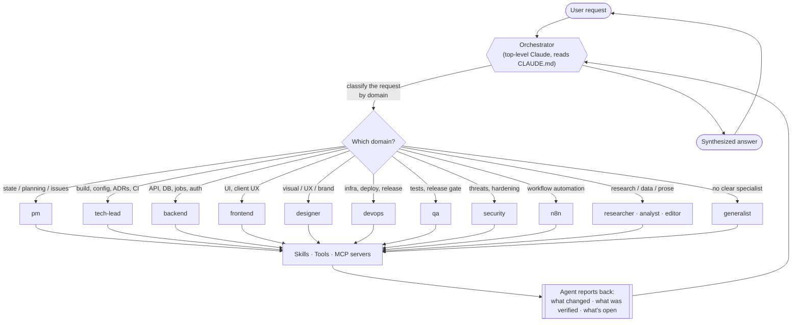
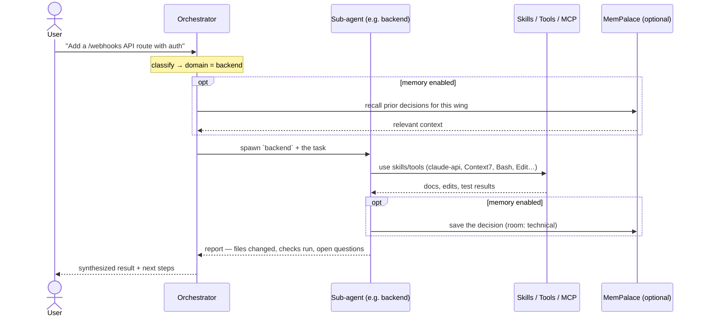
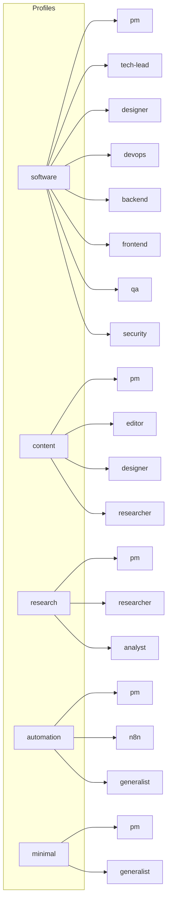

# Agents & the orchestration model

[English](agents.md) · [Español](agents.es.md)

[← Usage](usage.md) · **Agents & orchestration** · [Reference →](reference.md) · [README](../README.md)

claude-kit gives a project a small **organization** instead of one do-everything assistant. A top-level
**orchestrator** receives every request and routes it to the **sub-agent** that owns that domain. This
page explains why that matters, who the agents are, and exactly how a request flows through them.

## Why sub-agents (and not one big assistant)

A single assistant juggling architecture, UI, security, and copy in one context tends to blur
responsibilities and lose focus. Splitting the work into role agents buys you:

- **Focus** — each agent carries only its domain's instructions, skills, and tools, so its context
  stays sharp.
- **Right tools per role** — the `backend` agent gets `claude-api` + Context7; `qa` gets Playwright +
  Chrome DevTools; `n8n` gets the `n8n-*` skills + the `mcp__n8n__*` tools. No agent is overloaded.
- **Clear ownership** — every change has an obvious owner, and agents _defer_ across boundaries
  (`backend` routes UI work to `frontend`, infra to `devops`) instead of guessing.
- **Safer decisions** — domain calls are made by the role that has the depth, not by a generalist.

## The orchestrator

The orchestrator is the top-level Claude in the project. Its job is **routing and synthesis, not
domain work**. Per the project's `CLAUDE.md`:

> Spawn the matching agent for any domain task — do not answer domain decisions from the orchestrator level.

The orchestrator classifies, delegates, and stitches the answer back together. The agents do the
actual domain work, each with its own skills and tools.

## How one request is handled

If a task spans domains, the orchestrator delegates to several agents in turn (e.g. `backend` for the
endpoint, then `frontend` for the UI, then `qa` for the test) and synthesizes the combined result.

## The agents

Each agent is a file at `.claude/agents/<name>/AGENT.md` with a frontmatter contract (`name`,
`description`, `when_to_use`, `tools`, `skills`). Which agents exist in a project depends on its
[profile](#profiles--which-agents-you-get).

| Agent            | Owns                                                                                    | Invoked when                                                       | Key skills / tools                                           |
| ---------------- | --------------------------------------------------------------------------------------- | ------------------------------------------------------------------ | ------------------------------------------------------------ |
| `pm`             | Work state via GitHub; drafts issues, heals plan↔issue links, surfaces blockers         | "What's the state?", sprint planning, new-scope issues             | `task-sync` · `task-new` · `task-close` · `morning-briefing` |
| `tech-lead`      | Build system, toolchain, ADRs, CI/CD, lint rules, scaffolding                           | Config/toolchain changes, ADRs, CI changes, new modules            | Context7 · GitHub navigator                                  |
| `designer`       | Design system, brand, screens, motion, all visual/UX calls                              | Any visual decision, components, UX writing, a11y for UI           | design + GSAP skills                                         |
| `devops`         | Infra, CI/CD pipelines, deploy, release/distribution, migrations                        | Cloud/infra, GitHub Actions, secrets, monitoring, DNS              | Context7 · GitHub navigator                                  |
| `backend`        | API, data model/ORM, schema, jobs, realtime, auth, server logic                         | API routes, migrations, queues, WebSocket/SSE, integrations        | `claude-api` · Context7                                      |
| `frontend`       | All client UI, app shell, client UX, API integration, typed client surface              | Components, state, streaming, navigation, auth UI, animation       | `claude-api` · GSAP · Chrome DevTools · Context7             |
| `qa`             | E2E tests, acceptance verification, regression, the release gate                        | Writing/​debugging tests, a11y/perf audits, release gate           | Playwright · Chrome DevTools                                 |
| `security`       | Threat modeling, vuln audits, injection defense, auth/CSP/CORS, deps                    | Injection risks, auth hardening, CVEs, secrets hygiene             | `claude-api`                                                 |
| `researcher`     | Primary/secondary research, fact-checking, cited briefs                                 | Market/competitor scans, verifying a claim, source gathering       | `deep-research` · Context7                                   |
| `editor`         | Written content — structure, clarity, voice, line edits, publish-readiness              | Drafting/revising prose, structural + line edits, tone             | —                                                            |
| `analyst`        | Quantitative work — data wrangling, modeling, defensible recommendations                | Analyzing a dataset, metrics, sanity-checking a number             | Context7                                                     |
| `generalist`     | Whatever no specialist owns; investigates, executes, reports                            | Tasks with no clear specialist, or a lean project                  | —                                                            |
| `n8n`            | Building/validating/shipping n8n workflows via the n8n MCP + SDK                        | Workflows, nodes, Code nodes, expressions, credentials, executions | `n8n-*` skills · `mcp__n8n__*`                               |
| `local-delegate` | Dispatching NL chores to a local model ($0 API); orchestrates + quality-checks          | Summarize/classify/extract/translate/draft, especially batch jobs  | `kit-digest`                                                 |
| `auto-dev`       | Autonomous `agent:auto` CI coding agent — ticket → PR, never merges (paused by default) | A maintainer labels a well-scoped issue `agent:auto`               | `kit-task-start` · `kit-task-pr` · GitHub navigator          |

## Profiles — which agents you get

A **profile** decides which agents are scaffolded. Pick one at `/kit-init`; add or remove later with
`/kit-customize`.

## Customizing & extending

- **Add / edit / delete an agent** — `/kit-customize` (it auto-activates when you ask to create, edit,
  or delete an agent). It wires skills + tools, keeps `kit.config.json` roles and the `CLAUDE.md` table
  in sync, and lints the result.
- **Share an agent upstream** — `/kit-contribute` de-parameterizes your agent back into a template and
  opens a PR to the kit.

## Demos

Short terminal recordings of the flow in action live in [`docs/media/`](media/):

<!-- DEMOS:START -->

See **[Usage → demos](usage.md#scaffold-a-project--kit-init)** for terminal walkthroughs: onboarding
through the `claude` CLI (a real, re-timed session) and the `--dry-run` scaffold preview. Both are
reproducible — see [`docs/media/README.md`](media/README.md).

<!-- DEMOS:END -->
