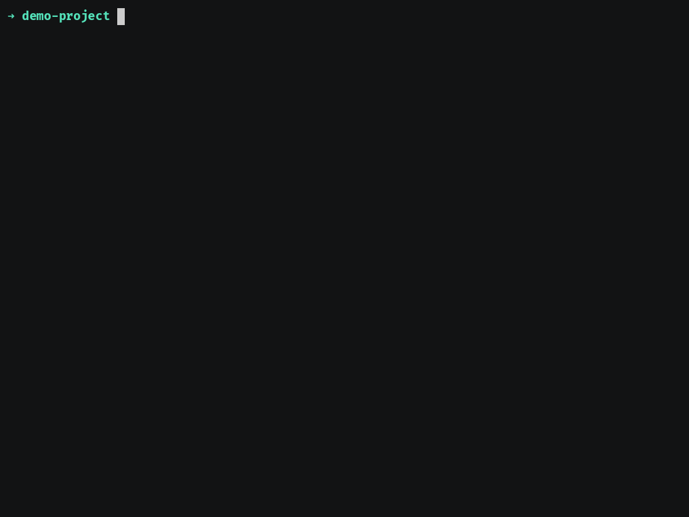

# Usar claude-kit

[English](usage.md) · [Español](usage.es.md)

[← README](../README.es.md) · **Uso** · [Agentes y orquestación →](agents.es.md) · [Referencia](reference.es.md)

## Qué incluye

| Capa                | Qué es                                                                                                                                                                                                                                                                  |
| ------------------- | ----------------------------------------------------------------------------------------------------------------------------------------------------------------------------------------------------------------------------------------------------------------------- |
| Commands            | `/kit-init` — genera `.claude/` desde un profile (con vista previa `--dry-run`) · `/kit-customize` — agrega/edita/elimina agents, conecta skills + tools, lint, arma profiles a medida · `/kit-contribute` — envía agents/skills/profiles/solicitudes upstream como PRs |
| Agents              | Sub-agents por rol (PM, Tech Lead, Designer, DevOps, Backend, Frontend, QA, Security, Researcher, Editor, Analyst, Generalist, n8n) — mira [Agentes y orquestación](agents.es.md)                                                                                       |
| Workflow skills     | `task-new` · `task-start` · `task-pr` · `task-pr-merge` · `task-pr-auto` · `task-sync` · `task-close` · `morning-briefing`                                                                                                                                              |
| Skills de contenido | `copywriting` — copy de conversión para landing pages / páginas de marketing (en el profile `content`)                                                                                                                                                                  |
| Skill universal     | `karpathy-guidelines` — guardarraíles contra errores comunes de LLM al programar, en **todos** los profiles                                                                                                                                                             |
| Stack skills        | `feature-build-refine` · `supabase-patterns` — **se autoactivan** (mira [Referencia](reference.es.md#stack-skills-autoactivables-convenciones-de-build))                                                                                                                |
| SDD                 | `speckit` — instala/identifica Spec Kit + conduce spec→plan→tasks→implement (opt-in)                                                                                                                                                                                    |
| Rules               | Estilo de comunicación · gestión de tareas · formato de planes · ruteo de diseño · MemPalace                                                                                                                                                                            |
| Workflow            | Issue → branch → PR → merge → close, todo vía GitHub (+ Projects v2 opcional)                                                                                                                                                                                           |
| Memoria             | Conexión opcional con MemPalace (hooks SessionStart/Stop/PreCompact) — desactivada por defecto                                                                                                                                                                          |

## Profiles

| Profile      | Agents                                                           | Para                               |
| ------------ | ---------------------------------------------------------------- | ---------------------------------- |
| `software`   | pm, tech-lead, designer, devops, backend, frontend, qa, security | Productos de software              |
| `content`    | pm, editor, designer, researcher                                 | Escritura / editorial / marca      |
| `research`   | pm, researcher, analyst                                          | Investigación + análisis           |
| `automation` | pm, n8n, generalist                                              | Automatización con n8n / workflows |
| `minimal`    | pm, generalist                                                   | Proyectos livianos                 |

Elige uno en el init; todo lo demás (roles, milestones, formato de planes) se deriva de ahí. Edita
`.claude/kit.config.json` después para ajustarlo.

## Estructura del proyecto y el modelo por-proyecto

claude-kit es **por proyecto**: ejecuta `/kit-init` dentro de cada proyecto para que tenga su propio
`.claude/` autocontenido. En un workspace o monorepo, inicializa **cada proyecto por separado** en vez
de una sola vez en la raíz — `/kit-init` detecta si estás en un solo proyecto o en un padre de varios y
recomienda según corresponda.

> **Hacia dónde va (v2):** un único "OS de proyecto" con raíz de workspace, cascada de config, modos y
> módulos apilables está en progreso — ver [claude-kit as a workspace OS](workspace-os.md) (en inglés).
> El modelo por-proyecto de esta página es el **vigente**.

Por qué por-proyecto:

- **Trazabilidad vía MemPalace** — cada proyecto mapea a su propio **wing** de memoria, así las
  decisiones, planes y diarios de los agentes se rastrean por proyecto y nunca se mezclan entre sí.
- **Autocontenido** — los agents, skills, rules y `kit.config.json` del proyecto viajan con el repo.
  Commitea `.claude/` y tu equipo comparte exactamente el mismo setup.

Layout recomendado:

```
tu-proyecto/
  CLAUDE.md              # punto de entrada — apunta a .claude/
  .claude/               # agents · skills · rules · kit.config.json · settings.local.json
  docs/plans/            # planes de implementación / ops (según la rule plan-output-format)
  scripts/               # helpers del kit (setup-labels, setup-milestones, task-sync, …)
  …tu código…
```

## Generar un proyecto — `/kit-init`

Después de [instalar](../README.es.md#instalación), ejecuta `/kit-init` en cualquier proyecto. Te
pregunta por profile, repo, board, memoria e idioma, y luego genera `.claude/` + `CLAUDE.md`. Durante
el onboarding también corre un **setup de herramientas opt-in** — verifica el auth de `gh` y (con tu
consentimiento) registra MemPalace o autentica `gws`, explicando cada paso antes de tocar nada.

Onboarding a través del CLI `claude` (sesión real, re-timed):


El `/kit-init` interactivo con valores de prueba — **re-creación ilustrativa** (los chips de respuesta
son simulados; la salida de scaffold debajo es `init.sh` real):



## Vista previa antes de generar (dry run)

Mira exactamente qué archivos escribiría un profile — sin crear nada:

```bash
"${CLAUDE_PLUGIN_ROOT}/scripts/init.sh" --profile software --name "My App" --dry-run
```


## Personalizar un proyecto ya generado — `/kit-customize`

Ejecuta `/kit-customize` en cualquier momento después del init (también se activa automáticamente
cuando pides crear / editar / eliminar un agent):

- **agregar, editar o eliminar un agent** — desde un template del kit o uno nuevo a medida
- **conectar skills + tools** a un agent (los nombres se resuelven primero, así no se inventa nada)
- **buscar / sugerir skills** para tu profile (vía `find-skills`)
- **lint** de tus agents (frontmatter, nombres de tools/skills, sin tokens de template sobrantes)
- **armar un profile a medida** — elige un preset o ensambla el tuyo, guardado en `~/.claude/kit-profiles/`
  para reutilizarlo

## Correr sin el plugin

El motor es un script de bash común. El kit se distribuye desde `packages/claude-kit-plugin/`
el repo standalone `jeiemgi/cckit` — clónalo y
ejecuta el script directo:

```bash
git clone https://github.com/jeiemgi/cckit ~/.cckit
cd /ruta/a/tu/proyecto
~/.cckit/scripts/init.sh --profile software --repo me/my-app --name "My App"
```
